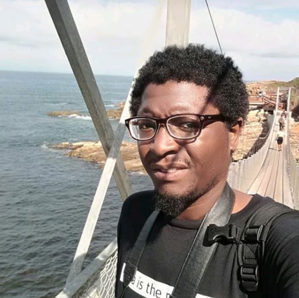

<h4><em>I'm  Francis Butawu a Systems Administrator going DevOps</em></h4>

<h3> - ⚡ Fun fact: <em>I always learn from mistakes of others who take my advice</em>  </h3>
                                                                    
<My Other Bio https://alpha-geek.github.io/francisb/>

<h5>During the day I'm  a </h5>

- [x] Web Developer
- [x] Linux Sys Admin
- [x] Windows Sys Admin
- [x] Software Developer
- [ ] DevOps Engineer

<h5>During the night I'm a </h5>

- [x] Tinkerer 
- [x] Hacker
- [x] Mentor
- [x] Coder
- [ ] Student

My Hobbies | Interests
------------ | -------------
Photography| IoT
Electronics | Cloud Computing

<!--**alpha-geek/alpha-geek** is a ✨ _special_ ✨ repository because its `README.md` (this file) appears on your GitHub -->
- 🔭 I’m currently working on Python and Django 
- 🌱 I’m currently learning DevOps Tools  
- 👯 I’m looking to collaborate Any Open source Projects  
- 🤔 I’m looking for help with ... 
- 💬 Ask me about any Networking or Infrasructure stuff  
-  📫 How to reach me: https://www.techcape.co.za 

